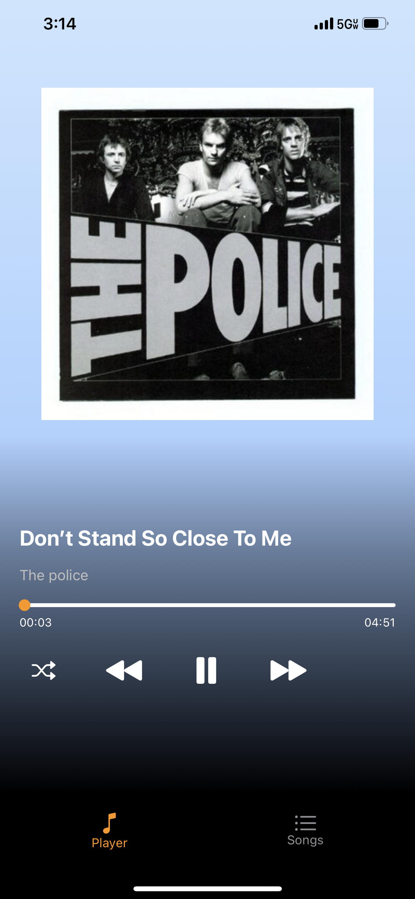
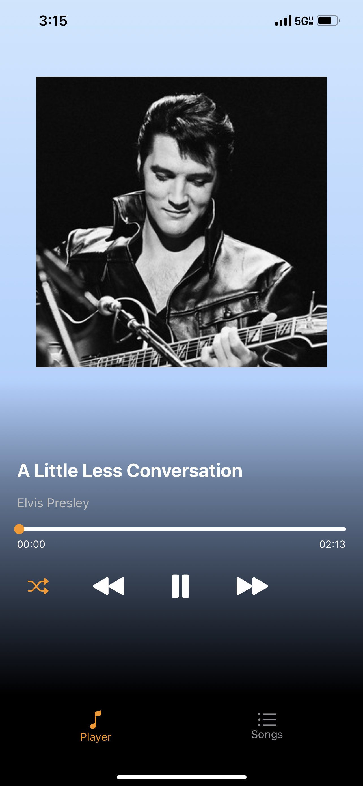
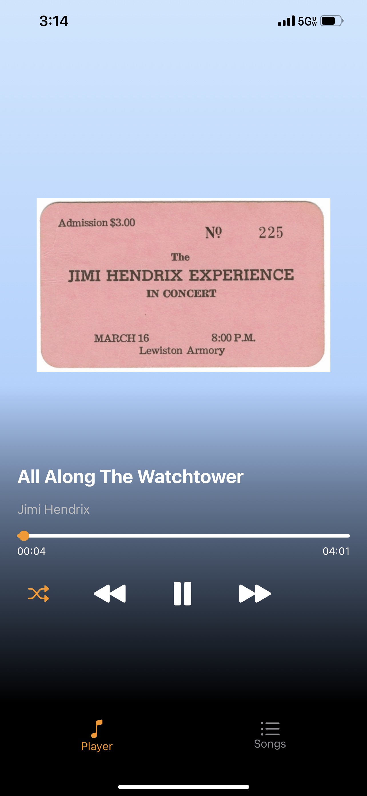
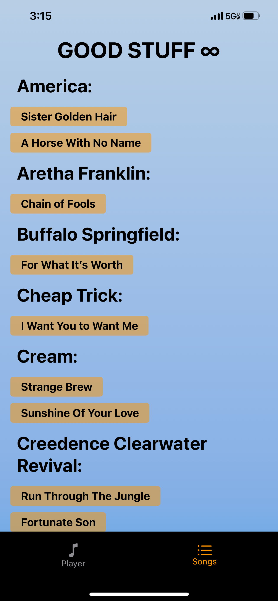

# GoodStuff – iOS Music Player

## Overview
GoodStuff is a lightweight music player app for iOS that I built for my dad. It focuses on simplicity, offline playback, and easy navigation — ideal for users who just want a clean way to listen to their music without extra features getting in the way.

## Features
- Offline local audio playback
- Simple, minimal UI designed for accessibility
- Basic playback controls: play, pause, skip, shuffle, scrub
- Song art display
- Fully compatable with Apple CarPlay

## Tech Stack
- Swift
- UIKit
- AVFoundation

## Screenshots






## How to Run
1. Clone the repo:
   ```bash
   git clone https://github.com/Ecgal/GoodStuff-MusicPlayer.git

2. Open the .xcodeproj file in Xcode
3. Build and run on a simulator or physical device (iOS 15+ recommended)


##License

This project is for demonstration and educational purposes only. Please don’t use it commercially without permission.
